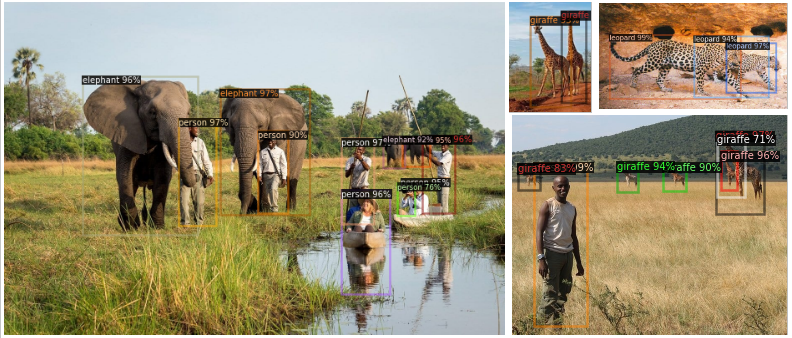

# Compressed Object Detection (COD)

Authors: [Gedeon Muhawenayo](https://gedeonmuhawenayo.github.io/) and [Georgia Gkioxari](https://gkioxari.github.io/)

#### Extension of pruning and quantization to the task of object detection

In this work, we extended pruning, a compression technique which discards unnecessary model connections, and weight sharing techniques for the task of object detection. With our approach we are able to compress a state-of-the-art object detection model by 30.0% without a loss in performance. We also show that our compressed model can be easily initialized with existing pre-trained weights, and thus is able to fully utilize published state-of-the-art model zoos.

Here is the [paper](https://gedeonmuhawenayo.github.io/files/projects/compression/AMMI_FINAL_PAPER.pdf), [arXiv](https://arxiv.org/abs/2102.02896) and here is the project [poster](https://github.com/Gedeon-m-gedus/compressed_object_detection/blob/main/docs/compressed_object_detection_BAI_poster.png).

Our implementation is built on top of [Detectron2](https://detectron2.readthedocs.io/) and [Pytorch Prunning labrary](https://pytorch.org/tutorials/intermediate/pruning_tutorial.html).

#### Dataset
We have collected our dataset from East African parks, it contains 1309 instances. Download the data [here](https://drive.google.com/file/d/141iHvqb_rD_WwtIhespCSA9maHzQCbb2/view?usp=sharing). The following dictionary describes the categories of animals that we are aware of and their number of instances into the dataset. Keys represent the animal category while the value represent the number of instances per that category {’giraffe’: 101, ’person’: 152, ’zebra’: 131, ’elephant’: 166, ’impala’: 169, ’monkey’: 80, ’lion’: 108, ’leopard’: 63, ’crocodile’: 61, ’buffalo’: 97, ’hyena’: 70, ’bird’: 123, ’gorilla’: 88}.

#### Results

#### Sample predictions from the compressed model

We show that pruning and quantization techniques can efficiently compress object recognition models with little loss in performance. We can prune 40% of the model with loss of a few points in average precision. The reduction in memory allows for efficient storage and enables deployment of object detectors on devices of lower computational capacity.

#### References
[1] Steven L. Brunton and J. Nathan Kutz. Dimensionality Reduction and Transforms, page 1–2.
Cambridge University Press, 2019.

[2] Yu Cheng, Duo Wang, Pan Zhou, and Tao Zhang. A survey of model compression and
acceleration for deep neural networks, 2017.

[3] Angela Fan, Pierre Stock, Benjamin Graham, Edouard Grave, Remi Gribonval, Herve Jegou,
and Armand Joulin. Training with quantization noise for extreme model compression, 2020.

[4] R. Girshick, J. Donahue, T. Darrell, and J. Malik. Rich feature hierarchies for accurate object
detection and semantic segmentation. In 2014 IEEE Conference on Computer Vision and
Pattern Recognition, pages 580–587, 2014.

[5] Ross Girshick, Ilija Radosavovic, Georgia Gkioxari, Piotr Dollár, and Kaiming He. Detectron.
https://github.com/facebookresearch/detectron, 2018.

[6] Georgia Gkioxari, Jitendra Malik, and Justin Johnson. Mesh r-cnn, 2019.

[7] Babak Hassibi, David G. Stork, and Gregory Wolff. Optimal brain surgeon: Extensions and
performance comparisons. In J. D. Cowan, G. Tesauro, and J. Alspector, editors, Advances in
Neural Information Processing Systems 6, pages 263–270. Morgan-Kaufmann, 1994.

[8] Kaiming He, Georgia Gkioxari, Piotr Dollár, and Ross Girshick. Mask r-cnn, 2017.

[9] Yang He, Guoliang Kang, Xuanyi Dong, Yanwei Fu, and Yi Yang. Soft filter pruning for
accelerating deep convolutional neural networks, 2018.

[10] Sambhav R. Jain, Albert Gural, Michael Wu, and Chris H. Dick. Trained quantization thresholds
for accurate and efficient fixed-point inference of deep neural networks, 2019.

[11] Licheng Jiao, Fan Zhang, Fang Liu, Shuyuan Yang, Lingling Li, Zhixi Feng, and Rong Qu. A
survey of deep learning-based object detection. IEEE Access, 7:128837–128868, 2019.

[12] Yann LeCun, John S. Denker, and Sara A. Solla. Optimal brain damage. In D. S. Touretzky, editor, Advances in Neural Information Processing Systems 2, pages 598–605. Morgan-Kaufmann,1990.

[13] Tsung-Yi Lin, Piotr Dollár, Ross Girshick, Kaiming He, Bharath Hariharan, and Serge Belongie.
Feature pyramid networks for object detection, 2016.

[14] Zhuang Liu, Mingjie Sun, Tinghui Zhou, Gao Huang, and Trevor Darrell. Rethinking the value
of network pruning, 2018.

[15] Prateeth Nayak, David Zhang, and Sek Chai. Bit efficient quantization for deep neural networks,

[16] Michela Paganini and Jessica Forde. On iterative neural network pruning, reinitialization, and
the similarity of masks, 2020.

[17] Morteza Mousa Pasandi, Mohsen Hajabdollahi, Nader Karimi, and Shadrokh Samavi. Modeling
of pruning techniques for deep neural networks simplification, 2020.

[18] Adam Paszke, Sam Gross, Francisco Massa, Adam Lerer, James Bradbury, Gregory Chanan,
Trevor Killeen, Zeming Lin, Natalia Gimelshein, Luca Antiga, Alban Desmaison, Andreas
Kopf, Edward Yang, Zachary DeVito, Martin Raison, Alykhan Tejani, Sasank Chilamkurthy,
Benoit Steiner, Lu Fang, Junjie Bai, and Soumith Chintala. Pytorch: An imperative style, highperformance deep learning library. In H. Wallach, H. Larochelle, A. Beygelzimer, F. d'AlchéBuc, E. Fox, and R. Garnett, editors, Advances in Neural Information Processing Systems 32,
pages 8024–8035. Curran Associates, Inc., 2019.

[19] Haotong Qin, Ruihao Gong, Xianglong Liu, Xiao Bai, Jingkuan Song, and Nicu Sebe. Binary
neural networks: A survey. Pattern Recognition, 105:107281, Sep 2020.

[20] Joseph Redmon, Santosh Divvala, Ross Girshick, and Ali Farhadi. You only look once: Unified,
real-time object detection, 2015.

[21] Joseph Redmon and Ali Farhadi. Yolov3: An incremental improvement, 2018.

[22] Shaoqing Ren, Kaiming He, Ross Girshick, and Jian Sun. Faster r-cnn: Towards real-time
object detection with region proposal networks, 2015.

[23] Yuxin Wu, Alexander Kirillov, Francisco Massa, Wan-Yen Lo, and Ross Girshick. Detectron2.
https://github.com/facebookresearch/detectron2, 2019.

